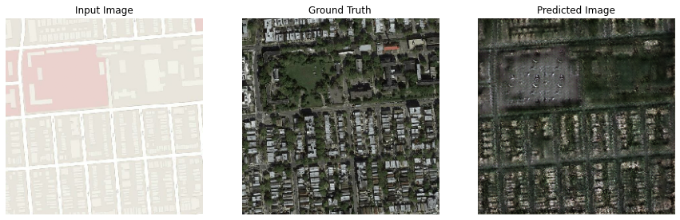

# GAN-Computer-Vision
 
 
1) Pix2pix model : 
   
   Google Colab : https://colab.research.google.com/drive/13eGaq9dK6uI7Zsdjib3d9UYz2G6t0_l_
    
  <li>I've built and trained the pix2pix model from scratch using Tensorflow. It converts google map photo to google earth photo.</li>
   
  
 
 
2) DCGAN model :
   
   Google Colab : https://colab.research.google.com/drive/1bjCoN77tKE6wMA5jbDOfE9ah6Blrune4#scrollTo=ZBwyU6t2Wf3g 
